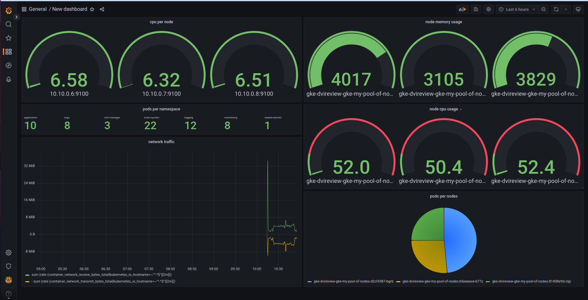

# portfolio-

### this is the application repo
check the manifist repo [here](https://github.com/dvir-pashut/port-infra).
and the gitops repo  [here](https://github.com/dvir-pashut/port-charts).

## repo summery
this repo contains the apllication itself the static files and the CI-CD file
to build localy you can run   
sh'''
docker compose up -d
''' 

## the project architecture
 
## the app architecture
 
## the git workflow
 
## grafana dashboard
 
## kibana dashboard
 

## simply running terraform apply will give you this 

## the tools for the project
<ol>
  <li>Ci         - github action</li>
  <li>notifications   - slack</li>
  <li>cloud      - gcp</li>
  <li>deployment - k8s</li>
  <li>database       - mongodb</li>
  <li>rest api   - Flask(python)</li>
  <li>logging       - EFK(elastic, fluentd, kibana)</li>
  <li>monitoring       - prometheus and grafana</li>
  <li>certification       - let's encrypt</li>
  <li>IAC       - terraform</li>
  <li>secrete managment       - bitnami sealed secretes+ google secretes</li>
  <li>gitops       - argocd</li>
  <li>static files       - gcp bucket</li>
</ol>
